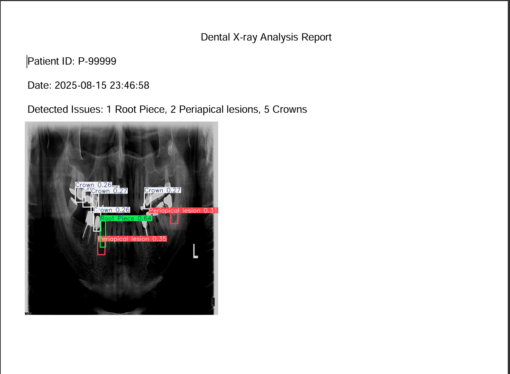

# 🦷 Dental X-ray AI Assistant

A lightweight, CPU-trained deep learning application that assists dentists by detecting 10 dental classes from panoramic X-ray images. The system allows image upload, draws bounding boxes using a YOLOv8 model, and generates a downloadable PDF report containing the prediction results, patient ID, and scan date.

> ⚙️ **Trained on CPU — no GPU used. Built with focus, grit, and zero excuses.**

---

##  Problem

Dental panoramic X-rays contain complex visual structures that are difficult and time-consuming to analyze manually. Dentists often need support identifying anatomical landmarks or dental issues with consistency and speed.

---

## 💡 Solution

An AI-powered assistant that automates detection of key dental structures or issues from an X-ray image. After upload, the model runs inference using YOLOv8 and generates a report for the patient.

---

##  Features

- 📤 Upload panoramic dental X-ray (PNG/JPG)
- 🔎 Run inference with trained YOLOv8 model
- 🖼️ See bounding boxes for detected conditions
- 🧾 Input Patient ID
- 📥 Download a clean PDF report (date, ID, detections)
- 🌐 Clean, responsive Gradio interface

---

##  Tech Stack

- YOLOv8 (PyTorch)
- Gradio (for web interface)
- ReportLab (PDF generation)
- Python 3.10+

## 📸 App Preview

| Upload Panel | Output + PDF | Detection Screenshot |
|---|---|---|
|  |  |  |

